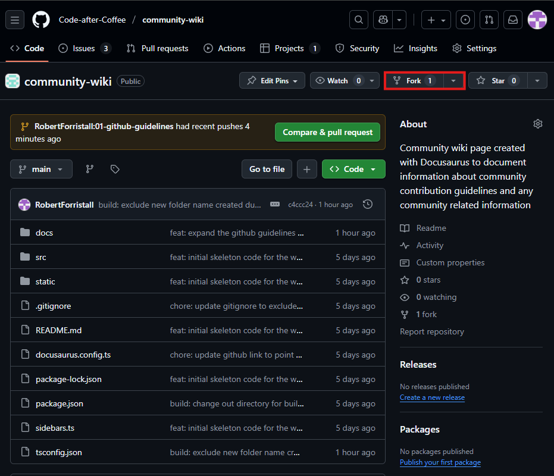
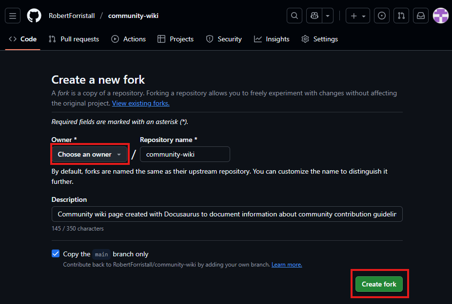

# Fork

Forking is a feature of Github that allows for a user to create a copy of an existing repository that is linked with their private github account.

While working directly with source repositories for community driven projects is an option for users on Github; this community will do the bulk of development within forks that are made from the source repository in order to ensure that any changes to the code base of projects can be better controlled and managed.

## Creating a fork

To create a fork of a currently ongoing project within the community's Github organization simply navigate to the desired repository that you want to fork and select the fork option as highlighted below:

After selecting the fork option you will be brought to a screen where you can do the following:
- Change the name of the forked repo
- Select the owner of the forked repo (This should be set to your personal Github account)
- Modify the description of the forked repo
- Choose if you want to copy only the main branch of the repo or all branches attached to it
For the purposes of this community and its forking needs the only thing that needs to be set is the owner of the new repo before then the repo can be created.

Once the forking is complete then Github should automatically navigate the browser to your new personal copy of the original repository where you can begin working on developments that can be contributed to the source repository.