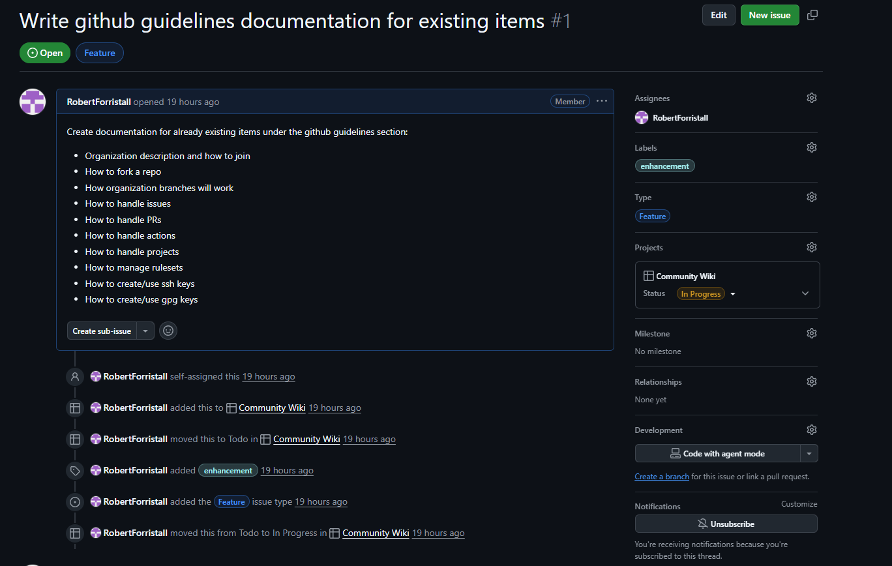

# Issues

Github issues tasks created in relation to the current project and aim to give direction into what features/bugs are planned for the current version of the project.

Github issues contain the following information to describe the type of task that the issue aims to accomplish:

- `Title`: A simple to read title of what the issue aims to resolve
- `Issue Number`: A numeric identifier for the issue that can be used to easily reference the issue elsewhere
- `Description`: A more detailed description of what the issue aims to resolve
- `Assignees`: Contributors that have been assigned to handle the task
- `Labels`: A label or set of labels that describes the issue and additional needs to resolve it
    - `enhancement`: A new feature for the project
    - `bug`: A bug or issue with the current implementation of the project
    - `documentation`: Improvements or additions to the project's documentation
    - `duplicate`: A issue that is a duplicate of an already exisiting issue or pull request
    - `good first issue`: Issues that are good for new contributors of an already exisiting project
    - `help wanted`: Additional attention is needed on this issue to resolve it
    - `invalid`: There is a problem with the Github issue that needs to be addressed
    - `question`: Additional information is needed before the issue can be resolved
    - `wontfix`: Issues that are known but not currently planned to be addressed
- `Type`: A simple type for the issue that describes what kind of work needs to be done
    - `Bug`: An unexpected problem or behavior with the current implementation of the project
    - `Feature`: A request, idea, or new functionality that will enhance the current implementation of the project
    - `Task`: General tasks that address a very specific part of the project
- `Projects`: Associated Github [projects](./projects.md) that the issue is linked to
- `Milestone`: Project milestones that this issue is related to
- `Development`: A link to the [Pull Request](./pull-requests.md) or [branch](./branches.md) that is made to solve the issue

Example issue created for the Community Wiki project:

