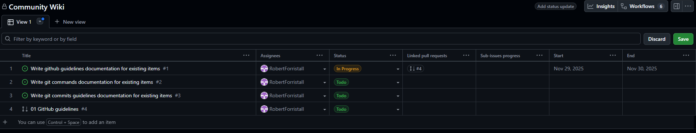
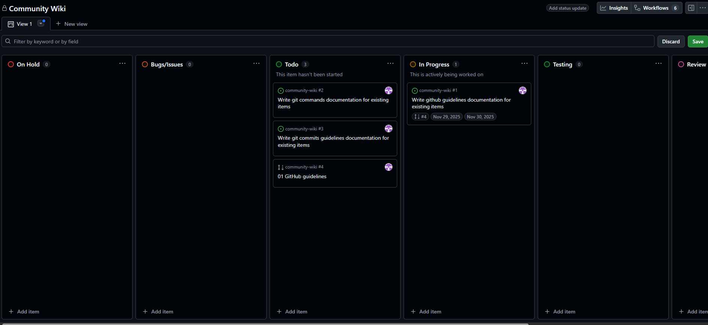
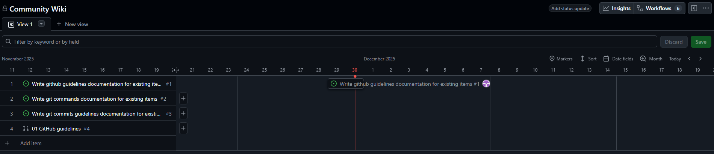

# Projects

Github projects are a tool of Github that allows for management of the progress of a project and allows a visualization of tasks/issues and where they are in the development process.

## Visual Styles

### Table

A simple table like view of tasks that shows the title of the task, assignees, status, and any relevant linked information

### Board

A task board that splits tasks across the different statuses available and allows for easily moving tasks between statuses

### Roadmap

A gantt chart that allows for easily labeling when certain tasks are started and when they are completed along with including potentially more date labels when it changes status

## Status Sections

Projects can have custom sections but there are a number of sections that can be used as a starting point that cover most of the different statuses that a project would need:
- `On Hold`: Tasks that are currently on hold while another task is finished or another issue in completing the task is present
- `Bugs/Issues`: Tasks that address specific bugs and issues in the current implementation
- `Features`: Tasks that enchance the project in some form
- `In Progress`: Tasks that have been started by someone
- `Testing`: Tasks that have been implemented and are currently having tests written or is being activly tested
- `Review`: Tasks that have been implemented and tested but are waiting for a review of the task to be completed before merging
- `Done`: Tasks that have been fully completed and merged

## Creating Tasks

To create a task click the `+` icon at the bottom of any view and select `Create new issue` which will open a screen similar to the one that appears when creating a new issue which is described in the Github [issues](./issues.md) section of this documentation.