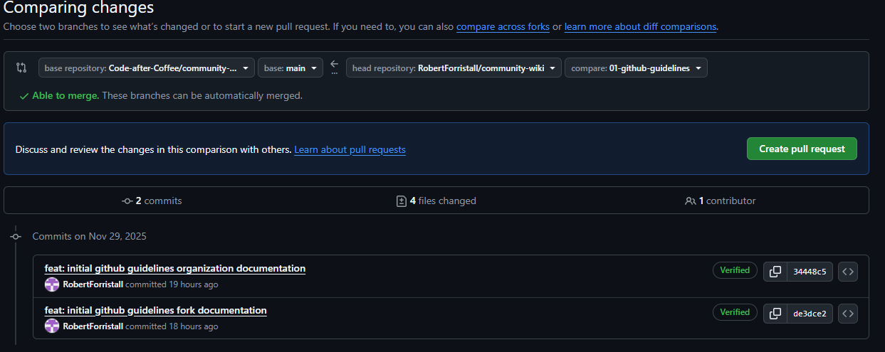
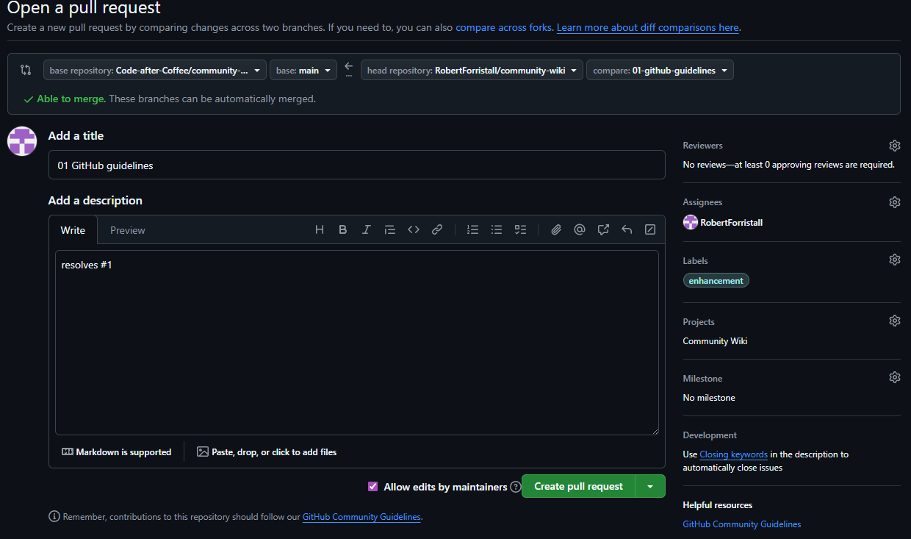
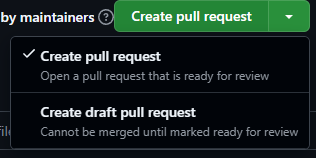

# Pull Requests

Pull requests in Github are the main method that new changes will be merged into the source repository from forked development repositories.

## Creating a pull request

To create a pull request navigate to the `Pull Requests` section of the organization's github repository and select to create a new pull request.

After selecting this option you will have to select which branch will be merged into the other when the pull request is resolved:
- `base repository`: The repository with the branch that changes will be merged into; usually should be the source repository
- `base`: The branch of the base repository that will have the changes merged into; usually should be a `<version>-dev` or `main` branch
- `head repository`: The repository with the branch that changes will be merged from; usually should be a forked repository
- `compare`: The branch in the head repository that will have its changes merged into the base repository

After selecting all of these options an overview of what changes will be added from the head repository into the base repository are shown to the user along with if an automatic merge is able to be done.

After selecting create pull request you will be brought to a screen similar to the screen when creating a Github [issue](./issues.md) where additional information about the pull request can be added.

For most sections simply select the same items that are used in the issue that the PR aims to resolve except for two:
- Title will use the name of the branch that the PR is made from and can be left alone
- In the description of the PR make sure to include what items of the related issue were completed and make sure to include a `Closing Keyword` to link the PR to its related issue
    - Keywords
        - close
        - closes
        - closed
        - fix
        - fixes
        - fixed
        - resolve
        - resolves
        - resolved
    - Example: `resolves #1`

Lastly if the PR is not ready for review and is simply being created to allow for linking the development branch to the associated Github issue then click the down arrow next to `Create pull request` and select to make a `draft pull request` which can not be merged until it is marked as ready for review.

## Reviewing a pull request

<!-- TODO: add reviewing pull request documentation -->