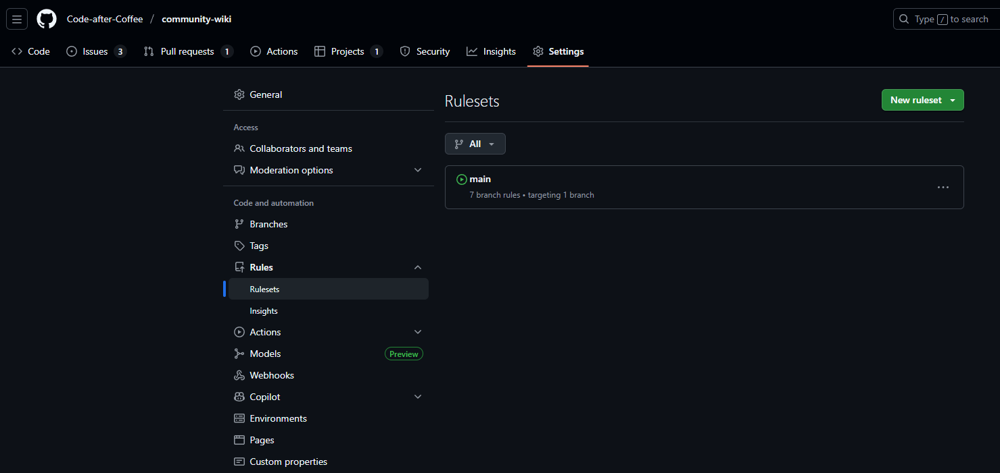
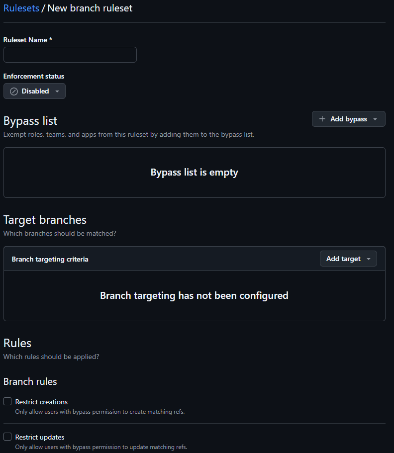
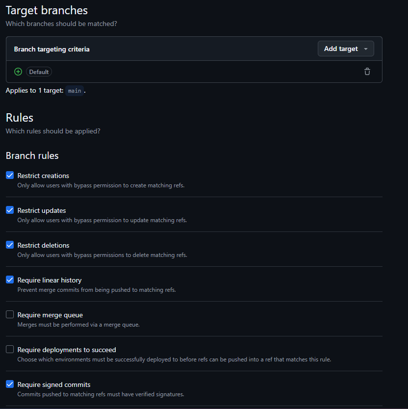
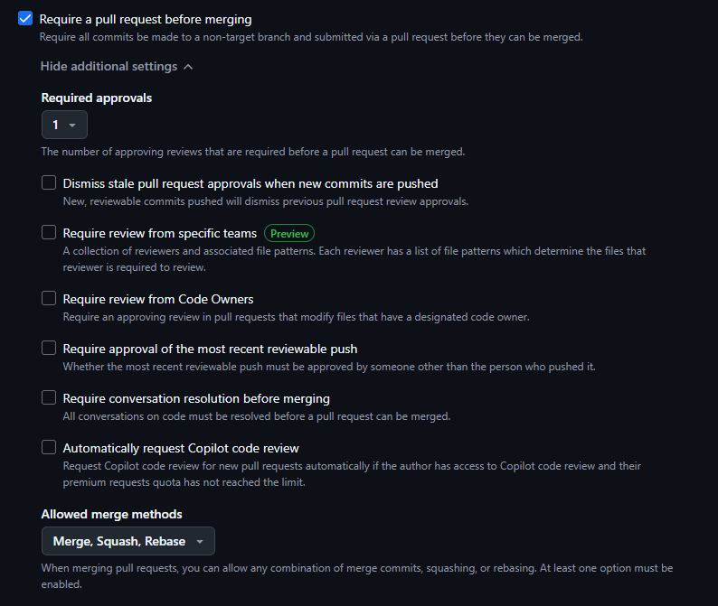

# Rulesets

Github rulesets are rules placed on specific branches that must be followed by contributors in order to interact with those branches of the repository.

These rules are useful in protecting specific branches and controlling the overall flow of any contributions that can be made.

## Accessing rulesets for a repository

Admins of a repository can access the rulesets section of the repository by first navigating to the repository settings and selecting `Rules` then `Rulesets` on the side bar menu

## Creating a new ruleset

To create a new ruleset select `New ruleset` and select either a ruleset for branches or tags then select the items that you want to handle in the ruleset.

## Main branch ruleset

All projects in the community should have a main branch ruleset that ensures the main branch of a repository is protected from contributions.

The following are the bare minimum rules that should be set on this ruleset:
- The target branch should point to the `main` branch of the repository
- `Restrict creations` should be selected to limit who can create new files in the repo
- `Restirct updates` should be selected to limit who can update files in the repo
- `Restrict deletions` should be selected to limit who can delete files in the repo
- `Require linear history` should be selected to ensure that merges with conflicting commit histories can cont be completed
- `Require pull requests before merging` to make sure that any additions to the main branch are controlled and validated properly
    - Set the required approvals to include at least 1 person which will perferably be a lead on the project
    - Allow Merge and Squash as merge methods; Rebase is optional since all PRs should have already handled any need for a rebase prior to merging

One other optional but recommended ruleset to include is `Require signed commits` as it ensures better security for commits that are to be added to the repository.
- More information about using signed commits can be found in the [GPG Keys](./gpg-keys.md) section of the Community Wiki

## Example main branch ruleset

## Example require pull requests before merging
